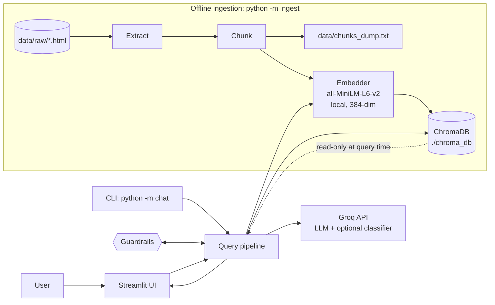
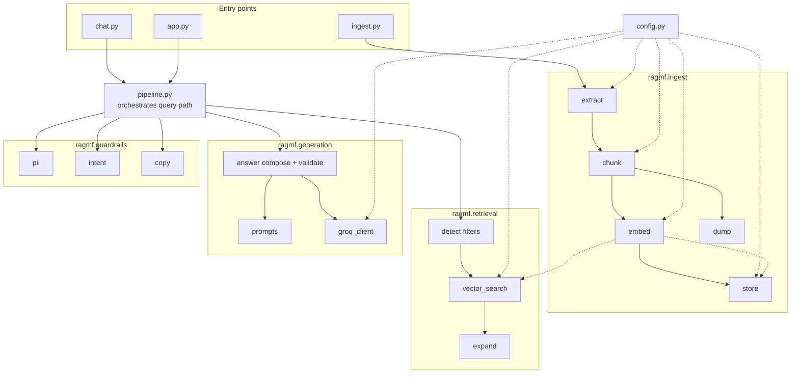
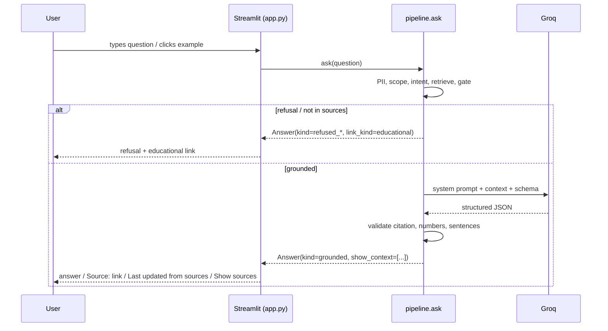

# Architecture — Mutual Fund FAQ Chatbot (Facts-Only RAG)

**Status:** Draft
**Version:** 1.0
**Implements:** `PRD.md` v1.0 (all FR-1 … FR-7, NFR §9)
**Source brief:** `docs/Problemstatement.txt`

This document turns the PRD's technical design (§8) into a concrete system: module boundaries, data
flow, interfaces, storage schemas, guardrail placement, and the decisions behind them. Where this
document adds detail beyond the PRD, the PRD still governs intent; conflicts get resolved in favour
of the PRD and flagged here.

---

## 1. Architecture drivers

Four constraints shape every decision below. They are taken directly from the brief.

| # | Driver | Architectural consequence |
|---|---------|---------------------------|
| D1 | Embedding model is fixed: `all-MiniLM-L6-v2`, 384-dim, local, no key | Embedder is a process-wide singleton; same instance embeds chunks and queries. No other model anywhere. |
| D2 | Ingestion runs once, ChromaDB persists to disk | Ingestion and query are **separate entry points** sharing one read-only store. No implicit indexing on startup. |
| D3 | Every answer carries exactly one citation, ≤ 3 sentences, no advice | Citation is **deterministic and server-derived**, not model-generated prose. Post-hoc validators enforce length and numeric grounding. |
| D4 | Groq is the only remote call; key in `.env` | Exactly one outbound HTTP client in the codebase, behind one module. Everything else is local. |

Secondary driver: the corpus is tiny and table-heavy (5 scheme pages). That makes **structure-aware
chunking and metadata filters** more valuable than sophisticated ranking, and it makes a relevance
threshold essential to avoid confident answers about uncovered questions.

---

## 2. System context



**Trust boundary:** the only data leaving the machine is (a) the user's question and (b) retrieved
chunk text, both sent to Groq for generation. Embeddings and the vector store never leave the host.

---

## 3. Module map



| Package | Responsibility | Must not do |
|---------|----------------|-------------|
| `config` | All tunables and secrets loading | Contain logic |
| `models` | Dataclasses for `Document`, `Chunk`, `QueryResult`, `Answer` | Contain I/O |
| `ingest` | Raw page → text → chunks → vectors → ChromaDB + dump | Talk to the LLM; touch `.env` |
| `retrieval` | Question → filters → top-k chunks → expanded context | Generate text |
| `generation` | Prompt assembly, Groq call, response validation | Retrieve; decide policy |
| `guardrails` | PII detection, intent classification, refusal copy | Access ChromaDB or Groq (except optional classifier) |
| `pipeline` | Single orchestrator: the §5 query path | Contain parsing or prompt text |

**Dependency rule:** only `pipeline` may import across all packages. Siblings never import each
other. This keeps the query path testable by swapping any single stage.

---

## 4. Repository layout

```
rag-chatbot/
├── PRD.md
├── architecture.md                  # this document
├── README.md
├── requirements.txt                 # pinned
├── .env.example                     # GROQ_API_KEY=your_key_here
├── .gitignore                       # .env, chroma_db/, __pycache__/
│
├── app.py                           # Streamlit UI  (python -m streamlit run app.py)
├── chat.py                          # CLI chat      (python -m chat)
├── ingest.py                        # ingestion CLI  (python -m ingest)
│
├── src/ragmf/
│   ├── __init__.py
│   ├── config.py
│   ├── models.py
│   ├── pipeline.py                  # ask(question) -> Answer
│   ├── ingest/
│   │   ├── __init__.py
│   │   ├── fetch.py                 # one-time URL -> data/raw/*.html
│   │   ├── extract.py               # HTML -> Block[] (headings, paragraphs, tables)
│   │   ├── chunk.py                 # Block[] -> Chunk[]
│   │   ├── embed.py                 # Embedder singleton
│   │   ├── store.py                 # Chroma wrapper (write path)
│   │   └── dump.py                  # chunks_dump.txt writer
│   ├── retrieval/
│   │   ├── __init__.py
│   │   ├── filters.py               # question -> scheme/category filters
│   │   ├── vector_search.py         # Chroma query (read path)
│   │   └── expand.py                # retrieve-then-expand
│   ├── generation/
│   │   ├── __init__.py
│   │   ├── prompts.py               # all prompt text
│   │   ├── groq_client.py           # the ONLY outbound HTTP client
│   │   └── answer.py                # compose + validate response
│   ├── guardrails/
│   │   ├── __init__.py
│   │   ├── pii.py                   # regex detection + redaction
│   │   ├── intent.py                # advice / performance / out_of_scope
│   │   └── copy.py                  # single source of truth for all UI copy
│   └── eval/
│       ├── __init__.py
│       └── harness.py               # runs sample_qa.md, scores criteria
│
├── data/
│   ├── raw/                         # saved source HTML (git-committed: reproducibility)
│   │   ├── hdfc-large-cap-direct-growth.html
│   │   └── ...
│   ├── sources.csv                  # D3
│   ├── chunks_dump.txt              # D7
│   └── sample_qa.md                 # D5
│
├── chroma_db/                       # persisted store (git-ignored, rebuilt via ingest)
├── tests/
│   ├── test_pii.py
│   ├── test_intent.py
│   ├── test_chunker.py
│   ├── test_validators.py
│   └── test_acceptance.py           # drives PRD §11 criteria 1-14
└── docs/
    └── Problemstatement.txt
```

`data/raw/` is committed deliberately: the reviewer can re-run ingestion with zero network access
and get byte-identical chunks (NFR "Reproducibility", PRD R10).

---

## 5. Query path (the runtime spine)

```
user question
   │
   ├─0─ preflight: is the store built? is GROQ_API_KEY present?   → fail fast, no answer
   │
   ├─1─ PII scan            (guardrails.pii)      ──match──→ REFUSE_PII (no echo, no log of value)
   │                                              (FR-5.1, 5.2, 5.3)
   ├─2─ scope check: is this plan in scope?     ──out──→ REFUSE_SCOPE (state Direct-Growth-only)
   ├─3─ intent classify     (guardrails.intent)  ──advice/performance──→ REFUSE with educational link
   │                                              (FR-4.1..4.4, PRD §6.4)
   ├─4─ detect filters      (retrieval.filters)  → scheme, category hints   (FR-2.2)
   ├─5─ embed question      (ingest.embed)       → 384-dim vector          (FR-2.1)
   ├─6─ vector search       (retrieval.vector_search) → top-k + scores     (FR-2.2)
   ├─7─ score gate          (retrieval.pipeline) ──below threshold──→ NOT_IN_SOURCES + link
   ├─8─ expand              (retrieval.expand)   → + neighbour chunks       (FR-2.3)
   ├─9─ generate            (generation.answer)  → structured JSON         (FR-3.1, 3.5)
  ├─10─ validate            (generation.answer)  → citation, numbers, sentence count
   │                                            (FR-3.2, 3.3, 3.6)
  └─11─ render              (UI)                 → answer, 1 link, date, sources expander
                                                    (FR-6.4, FR-3.4, FR-3.7)
```

Steps 1–3 are **deterministic and rule-based** and run before anything is embedded, sent, or logged.
That ordering is what makes "no PII stored" and "no advice given" structural rather than prompt-based.

Steps 6–10 are the grounding guarantee: the LLM may only choose among URLs that retrieval already
returned, and only numbers that appear in those chunks survive validation.

### Response envelope

`pipeline.ask()` returns one shape for every outcome, so the UI has a single code path:

```python
@dataclass
class Answer:
    kind: Literal["grounded", "not_in_sources", "refused_advice",
                  "refused_performance", "refused_pii", "refused_scope", "error"]
    text: str                      # <= 3 sentences, for UI display
    citation_url: str | None       # exactly one, or None for refusals
    citation_label: str | None
    sources_date: str | None       # "Last updated from sources: ..."
    link_kind: Literal["source", "educational", "factsheet", None]
    show_context: list[ChunkView]   # FR-2.5, FR-3.7 — always populated for grounded answers
    retrieval_scores: list[float]
    notes: str                     # internal only; never rendered
```

The UI never parses prose and never invents a link: it renders `text`, `citation_url`,
`sources_date`, `show_context`. The "Source:" and "Last updated from sources:" lines are **formatted
by the app from fields**, matching PRD §10.3 exactly.

---

## 6. Ingestion design

### 6.1 Entry point

`python -m ingest` — never invoked automatically. `--force` required to rebuild an existing store
(FR-1.8); without it, the run aborts if the store already exists.

`fetch.py` is a separate manual step (`python -m ingest --fetch-only`) so that re-indexing during the
demo never re-hits the network.

### 6.2 Extraction (`extract.py`)

Goal: turn a scheme page into a typed block stream that preserves the two structures that carry our
facts — **headings** (section identity) and **tables** (fee/risk/benchmark values).

```python
def extract_document(html: str, source: SourceRecord) -> list[Block]
```

| Block kind | Handling |
|------------|----------|
| `heading` | Recorded with level; sets the current `section_title` path (e.g. "Fees and charges › Exit load"). |
| `paragraph` | Text only, whitespace-normalised. |
| `list` | Items preserved as `- ` lines, not concatenated into one blob. |
| `table` | **Not** flattened naively. Each logical row becomes `label: value | label: value`, repeated, with the header row prepended when a chunk starts mid-table. |
| `faq_qa` | Detected `Q:` / `A:` pairs kept as one block with an explicit `Q:/A:` prefix so the embedder sees the question text. |
| `boilerplate` | Nav, cookie banners, footers, "app download" blocks → dropped by blocklist, never embedded. |

Boilerplate removal matters more than it looks: distributor pages carry large amounts of marketing
and nav text that would otherwise dominate the top-k for a generic question like "expense ratio".

### 6.3 Chunking (`chunk.py`)

Per PRD §8.2: structure-aware, ~350–450 tokens, ~60–80 token overlap, tables kept intact.

```python
def chunk_document(blocks: list[Block], cfg: ChunkConfig) -> list[Chunk]
```

Algorithm:

1. **Prepend context.** Every chunk text is prefixed with
   `"<scheme> — <plan> | <section path>\n"` so a chunk is interpretable out of context. This is
   concatenated for embedding only; the stored `text` field keeps the body clean.
2. **Group blocks under headings** into sections, carrying the heading path forward.
3. **Emit atomic units.** A `table` block or a `faq_qa` block is never split — it is one unit
   regardless of length (a fee table is short and must stay whole).
4. **Pack prose.** Consecutive paragraphs/lists are packed up to `max_tokens`, splitting only a unit
   longer than `max_tokens`, and only then with `overlap_tokens` of tail carry-over.
5. **Attach metadata** per PRD §8.3.
6. **Order by document position** so `chunk_id` is stable and neighbours are recoverable at query time.

Why this satisfies the "one question, one citation" goal: each emitted chunk is independently
answerable, so the top-ranked chunk's URL is almost always the correct single citation — no
post-hoc selection across chunks needed.

### 6.4 Embedding (`embed.py`)

```python
class Embedder:                       # process-wide singleton, lazily created
    def embed_documents(self, texts: list[str]) -> list[list[float]]   # 384-dim
    def embed_query(self, text: str) -> list[float]
```

- One `SentenceTransformer("sentence-transformers/all-MiniLM-L6-v2")` instance per process, shared by
  ingestion and query, guaranteeing identical vector spaces (D1, AC-17).
- Text is **not** lowercased or stripped of punctuation — the model's training normalisation is
  already appropriate, and chunk text needs to stay human-readable in the dump.
- Batched in groups of 64 with progress logging, so a full re-index is visible rather than silent.

### 6.5 Storage (`store.py`)

| Aspect | Value | Why |
|--------|-------|-----|
| Backend | `chromadb.PersistentClient(path="./chroma_db")` | D2 |
| Collection | `mf_faq` | Single collection keeps filtering simple for a 5-scheme corpus |
| Distance | `hnsw:space=cosine` | MiniLM vectors are comparable under cosine; distance is then `1 - sim` |
| Embedding function | `None` (we pass vectors in) | Chroma must not instantiate a different default embedder |
| `ids` | `chunk_id` | Upsert-safe re-index |
| Documents | Body text **with** the context prefix | Embedding quality; metadata holds the clean values |
| Metadatas | PRD §8.3 fields, **excluding** `text` | Chroma metadata must be scalar |

`chroma_db/` is git-ignored (regenerable) but `data/chunks_dump.txt` and `data/raw/` are committed,
so a reviewer can verify the index without running anything (G7, AC-15, AC-16).

### 6.6 Chunk dump (`dump.py`)

```text
================================================================================
CHUNK 24/186
chunk_id     : hdfc-large-cap-direct-growth::sec-007
scheme       : HDFC Large Cap Fund - Direct Growth
category     : fees
plan         : direct_growth
content_type : table
section_title: Fees and charges > Ongoing charges
url          : https://groww.in/mutual-funds/hdfc-large-cap-fund-direct-growth
fetched_at   : 2026-10-02
tokens       : 212
--------------------------------------------------------------------------------
text:
<chunk body>
```

One console line per document: chunks, tokens, mean size, and any parse failure (FR-1.9).

---

## 7. Retrieval design

### 7.1 Filter detection (`filters.py`)

Deterministic string/alias matching, no LLM:

```python
@dataclass
class QueryFilters:
    scheme: str | None       # canonical scheme name
    category: str | None     # strongest category hint
```

- Scheme aliases: `"large cap"`, `"largecap"`, `"hdfc large cap"` → canonical scheme. If two or more
  distinct schemes match, `scheme=None` (comparison question) and intent likely catches it.
- Category hints: `expense`/`fee`/`ratio` → `fees`; `exit load`/`charges`/`redemption` →
  `exit_load`; `sip`/`instalment` → `sip`; `lock in`/`lock-in`/`80C`/`elss` → `lock_in`;
  `riskometer`/`risk` → `riskometer`; `benchmark`/`index` → `benchmark`;
  `statement`/`tax`/`capital gains`/`download` → `tax_statement`.
- A detected category is used as a **soft** preference (retrieve `2k`, prefer category matches),
  never a hard filter — a hard filter turns an innocent phrasing miss into a false "not in sources".

### 7.2 Vector search (`vector_search.py`)

```python
def search(embedder, question_vec, filters, k, n_candidates) -> list[ScoredChunk]
```

- `n_candidates = 2 * k` retrieved, then reduced to `k`.
- Chroma `where` filter applied only when `filters.scheme` is unambiguous — prevents the wrong
  scheme's fee from being cited for a valid question (FR-2.2).
- **Diversity selection:** after retrieval, keep the highest-scoring chunk per `source_id + category`
  before filling the remaining slots, so a single dense section cannot fill the entire context and
  hide a contradicting source elsewhere. Conflicts must remain visible for FR-3.6.
- Returns `ScoredChunk(chunk, score, rank)` where `score = 1 - cosine_distance`.

**Fallback, staged and explicit:**

1. Dense (always).
2. If every candidate is below threshold → dense without scheme filter, once.
3. If still below → deterministic refusal (not an LLM call).

A hybrid BM25 path is a **documented non-goal for v1** (R4 lists it as a mitigation candidate);
MiniLM + structure-aware chunking + diversity selection is the v1 retrieval design, and adding
keyword search is a v1.1 decision once the acceptance harness gives us a regression signal.

### 7.3 Relevance gate

- Cosine similarity threshold `MIN_SIMILARITY`, default **0.35**, overridable via env, **calibrated
  during M3** against `data/sample_qa.md` plus a written set of out-of-scope questions
  (open question #4). The value is recorded in the README once measured.
- If `max(score) < MIN_SIMILARITY` → `kind="not_in_sources"` with the educational link. No LLM call,
  so an uncovered question can never produce a confident invented answer (FR-2.4, R5, R7).

### 7.4 Retrieve-then-expand (`expand.py`)

After the gate, the top-1 chunk's immediate neighbours (`chunk_id` ±1 within the same `source_id`) are
fetched and appended as **unranked context**, because fee/exit-load tables are routinely split across
a chunk boundary. Neighbour text is passed to the LLM but excluded from citation candidates, so
expansion cannot smuggle in a second URL (FR-2.3 + FR-3.2).

---

## 8. Generation design

### 8.1 Prompt contract (`prompts.py`)

All prompt text lives in one module and is versioned as a constant, `SYSTEM_PROMPT_V1`, so the demo
can quote exactly what ran.

**System role:** "You are a factual extraction assistant for a mutual fund FAQ. You answer only from
the numbered CONTEXT provided. If the context does not contain the answer, say so. Never use outside
knowledge. Never recommend, compare, rank, or project returns. Never ask for or repeat PAN, Aadhaar,
account numbers, OTPs, emails, or phone numbers. Answer in at most 3 sentences. Cite exactly one
source_url chosen from the allowed list."

**User payload:** the question, then numbered context blocks each tagged
`[scheme | category | source_url | content_type]`, then the allowed-URL list.

**Structured output** via Groq's JSON-schema response format:

```json
{
  "answer": "string, <= 3 sentences",
  "source_url": "string, must be one of allowed_urls",
  "grounded": "boolean — true only if context contains the answer",
  "conflict": "string, empty unless sources disagree",
  "incomplete": "boolean"
}
```

JSON-schema mode over free-form prose: the UI never parses sentences, and validators operate on
fields rather than regexing an answer blob (PRD §8.5).

### 8.2 Post-generation validation (`answer.py`)

Deterministic, no extra LLM calls:

| Check | Rule | On failure |
|-------|------|------------|
| `grounded` | LLM's own flag | Return `not_in_sources` + educational link (FR-3.5) |
| Citation exists | `source_url ∈ allowed_urls` | Substitute the top-1 retrieved chunk's URL; log a warning |
| Exactly one URL | No other `http` occurrence in `answer` | Strip extras, keep the allowed one |
| Sentence count | Split on `[.!?]` boundaries ≤ 3 | Truncate to 3 sentences |
| **Numeric grounding** | Every number+unit token in `answer` must appear in the context (whitespace/format-normalised) | Strip the ungrounded numbers, then re-check; if the answer is left meaningless, return `not_in_sources` |
| `conflict` | Non-empty | Append the conflict note and force the citation to the official-document URL (FR-3.6) |
| Advice leakage | Output scan for recommend/suggest/should/must buy patterns | Return the refusal template instead (defence in depth behind the intent classifier) |

The numeric-grounding check is the single most valuable guardrail here: the failure mode of this
system is a *plausible wrong percentage*, and it is caught deterministically before rendering.

### 8.3 `sources_date`

Computed as the **max `fetched_at` across cited chunks** and rendered as
`Last updated from sources: 2026-10-02` (FR-3.4). Deliberately the newest retrieved date, not today —
the display must reflect source freshness, and re-runs after a re-ingest update it automatically.

### 8.4 Groq client (`groq_client.py`)

Single seam for all remote traffic:

- Model from config (`GROQ_MODEL`), with `temperature=0` for factual extraction and `max_tokens`
  capped low — determinism matters more than fluency for a facts-only bot.
- One retry with backoff on 429/5xx; a second failure returns `kind="error"` with a retry message.
  **Never** falls back to a model-written answer (PRD §8.6, R10).
- `GROQ_API_KEY` read from `.env` at startup only; never logged, never sent to the browser. The key
  lives in the server process, so the Streamlit UI must not read it client-side (FR-7.1, FR-7.3).
- Optional secondary model for ambiguous intent classification only (§9.2), off by default.

---

## 9. Guardrail design

### 9.1 PII (`pii.py`)

Runs **first**, before embedding, logging, or any network call.

| Pattern | Detection |
|---------|-----------|
| PAN | `[A-Z]{5}[0-9]{4}[A-Z]` plus label cues (`pan`, `PAN number`) to reduce false positives |
| Aadhaar | 12-digit run, optionally space/`-` separated, with label cues |
| Account number | 9–18 digit run adjacent to `a/c`, `account`, `folio` |
| OTP | 4–6 digit run adjacent to `otp`, `verification code` |
| Email | Standard RFC-lite pattern |
| Phone | Indian mobile pattern, `+91` optional |

Behaviour: on match, return a neutral refusal and **do not echo the matched value** anywhere — not in
the reply, not in logs, not in the retrieval history (FR-5.2). Logging stores only
`sha256(question)[:12]` plus the matched *type*, never the value (FR-5.3).

Deliberate design choice: PII detection is pure pattern matching, never an LLM call. It must be
deterministic, free, and impossible to bypass via prompt phrasing.

### 9.2 Intent (`intent.py`)

Rule-first, LLM-second — determinism and cost for the common cases.

1. **Scope check (before intent).** Direct/IDCW vs Regular vs "HDFC Liquid" → out of corpus →
   `refused_scope`, stating the Direct-Growth-only scope (R3).
2. **Deterministic rules.** Regex/keyword sets from PRD §6.4 plus PR/AC 7–8: `should I`, `which is
   better`, `best`, `worth`, `suggest`, `recommend`, `compare returns`, `CAGR`, `how much will`,
   `5-year return`, `highest return`, `worth buying`, `my portfolio`, `is it good for me` →
   `refused_advice` / `refused_performance`.
3. **LLM classifier, only if rules are silent and retrieval is weak.** A single cheap Groq call with a
   three-way label (`facts` / `advice_or_performance` / `out_of_scope`) over the question alone. No
   context is sent, so a classifier can never be talked into answering a question by document text.
   Disabled by `RAGMF_INTENT_LLM=0`; the default is rule-only for the demo, since a deterministic
   system is easier to defend and to demo.
4. **Escalation on answer.** If a `facts` query produces an answer that trips the advice-leakage or
   numeric-grounding validator, the guardrail wins and the answer is replaced by the refusal
   template. Policy is enforced by the system, not requested of the model.

### 9.3 Copy (`copy.py`)

Single source of truth for the welcome line, the disclaimer, the three example questions, the
refusal templates, and the PII notice — imported by the UI, the CLI, and the eval harness
(FR-4.4, FR-6.1, FR-6.2, FR-6.3, D6). The README documents the same strings; a unit test asserts the
UI renders `DISCLAIMER` verbatim.

---

## 10. UI design



UI rules (FR-6):

- Single page. Welcome line from `copy.WELCOME`, `copy.DISCLAIMER` pinned above the input, three
  clickable `copy.EXAMPLE_QUESTIONS`.
- Every grounded message renders `text` → `Source: <citation_url>` → `Last updated from sources:
  <date>` → `Show sources ▾` expanding `show_context` with scheme, section, score, and URL.
- `st.session_state` holds only the message list for the current browser session. Nothing is written
  to disk (FR-5.4, NFR "Privacy").
- `st.spinner` while `ask()` runs; the UI never blocks the server (FR-6.5).
- The API key is never referenced in the UI layer.

---

## 11. Configuration

All values live in `src/ragmf/config.py`; env vars override; `.env` supplies only the key.

| Key | Default | Purpose |
|-----|---------|---------|
| `GROQ_API_KEY` | — (required) | LLM access; `.env` only (FR-7.1) |
| `GROQ_MODEL` | `llama-3.3-70b-versatile` | Generation model |
| `RAGMF_EMBED_MODEL` | `sentence-transformers/all-MiniLM-L6-v2` | Fixed by brief; overridable only for experiments |
| `RAGMF_CHROMA_DIR` | `./chroma_db` | Persisted store |
| `RAGMF_COLLECTION` | `mf_faq` | Collection name |
| `RAGMF_CHUNK_MAX_TOKENS` | `400` | Chunk target size (PRD §8.2) |
| `RAGMF_CHUNK_OVERLAP_TOKENS` | `70` | Chunk overlap |
| `RAGMF_TOP_K` | `5` | Chunks sent as ranked context |
| `RAGMF_MIN_SIMILARITY` | `0.35` | Relevance gate, calibrated in M3 |
| `RAGMF_MAX_SENTENCES` | `3` | Answer length cap (FR-3.3) |
| `RAGMF_INTENT_LLM` | `0` | Enable LLM intent fallback |
| `RAGMF_DEBUG_RETRIEVAL` | `0` | Print chunks/scores per query |

Startup validation (`config.load()`): key present and non-empty, else exit with
`Missing GROQ_API_KEY. Copy .env.example to .env and set your key.` (FR-7.3). Ingestion does not
require the key — it never calls the LLM — which keeps `python -m ingest` usable offline.

---

## 12. Error handling & failure modes

| Stage | Failure | Behaviour | User sees |
|-------|---------|-----------|-----------|
| preflight | Store missing | Halt, no auto-index | "Index not built. Run `python -m ingest`." |
| preflight | Missing key | Halt | Setup instructions |
| PII | Pattern match | Stop, redact | PII notice, no echo |
| intent | LLM classifier error | Fail **closed** to `refused_advice` | Refusal + educational link |
| retrieval | Chroma error | Retry once, then error | "Search is unavailable, try again." |
| gate | Below threshold | No LLM call | "I don't have that in my sources." + educational link |
| generation | 429 / 5xx | One backoff retry | "Service is busy, try again." — never a fabricated answer |
| generation | Invalid JSON | One re-ask with the schema error | Falls back to `not_in_sources` if it still fails |
| validation | Ungrounded number | Strip / escalate | Sanitised answer or "not in my sources" |
| UI | Streamlit rerun | `st.spinner` + disabled input | Loading state |

Two invariants across the whole path: **no fabricated fallback answer**, and **fail closed** — any
guardrail uncertainty resolves to a refusal, never to an answer.

---

## 13. Security & privacy

- `.env` git-ignored; `.env.example` committed with a placeholder (FR-7.2). Startup asserts the key
  is not the placeholder.
- `GROQ_API_KEY` never leaves the server process; the browser only talks to our app.
- Outbound requests go to Groq only. No analytics, no telemetry, no error-reporting SDK (FR-5.4).
- PII never reaches a log, the vector store, a prompt, or a disk file. The corpus is static public
  data, so ingestion itself carries no PII path.
- The vector store is read-only at query time; no user input is ever written to it.
- No auth, no database, no user accounts (PRD §4).

---

## 14. Data & artifact schemas

### `data/sources.csv` (D3)

```csv
source_id,scheme,category,plan,url,fetched_at,content_type,notes
hdfc-large-cap-direct-growth,HDFC Large Cap Fund - Direct Growth,overview,direct_growth,https://groww.in/mutual-funds/hdfc-large-cap-fund-direct-growth,2026-10-02,html,primary scheme page
amfi-nav-hdfc-large-cap,HDFC Large Cap Fund - Direct Growth,overview,direct_growth,https://www.amfiindia.com/...,2026-10-02,html,cross-check for expense ratio (R2)
```

`source_id` is the join key across `sources.csv`, Chroma metadata, and `chunks_dump.txt`, so any
answer's citation can be traced to a registered, publicly reachable source (AC-18).

### Chunk metadata in Chroma

Exactly PRD §8.3 minus `text` (stored in the document field): `chunk_id`, `source_id`, `scheme`,
`category`, `section_title`, `plan`, `url`, `fetched_at`, `content_type`. All scalar — Chroma rejects
nested metadata.

### `data/sample_qa.md` (D5)

5–10 rows: `query` | `kind` | `answer` | `citation_url` | `sources_date` | `notes`. Generated by
the eval harness, then hand-reviewed — the review is the point, not the generation.

---

## 15. Testing & evaluation strategy

| Layer | Test | Target |
|-------|------|--------|
| Unit | `test_pii.py` — every pattern, plus a near-miss that must **not** trigger | 0 false negatives on the AC-9 string |
| Unit | `test_intent.py` — full refusal set from PRD §6.4 + AC 7–8; factual set must not refuse | 100% / 0% false positives on facts |
| Unit | `test_chunker.py` — token caps, overlap, table integrity, `chunk_id` stability | No chunk exceeds `max_tokens` except a single atomic table |
| Unit | `test_validators.py` — citation substitution, sentence truncation, numeric-grounding strip | All rules trigger as specified |
| Integration | `test_acceptance.py` — drives PRD §11 criteria 1–14 against a real store | 14/14 |
| Eval | `ragmf/eval/harness.py` — runs `sample_qa.md` + an out-of-scope set; reports accuracy, refusal rate, avg latency, avg top-1 score | Feeds the M3 threshold calibration |

Threshold calibration method (M3, open question #4): sweep `RAGMF_MIN_SIMILARITY` over the in-scope
and out-of-scope question sets, pick the value with zero in-scope misses and maximal out-of-scope
rejection, record it in the README. Without a harness this would be a guess.

---

## 16. Latency budget

Target: end-to-end < 10s (NFR).

| Stage | Budget | Notes |
|-------|--------|-------|
| PII + intent (rules) | < 10 ms | no network |
| Question embedding | 20–60 ms | local MiniLM, cached singleton |
| Chroma query | 5–20 ms | tiny collection, in-process |
| Expansion + prompt build | < 5 ms | |
| Groq generation | 1.5–4 s | `temperature=0`, capped `max_tokens` |
| Validation + render | < 10 ms | |
| **Refusal path total** | **< 100 ms** | no LLM call at all |

The refusal path is deliberately network-free: in a demo, refusals are instant and unbreakable.

---

## 17. Design decisions (ADR summary)

| # | Decision | Alternatives rejected | Why |
|---|----------|----------------------|-----|
| AD-1 | Citation is server-derived and validated against retrieved URLs | Let the LLM write the citation | Deterministic "exactly one link" guarantee; no fabricated URLs (FR-3.2) |
| AD-2 | Structured JSON output via Groq schema | Free-form prose + regex parsing | Validators operate on fields; UI never parses sentences |
| AD-3 | PII + intent checks are rule-based and run first | LLM moderation | Deterministic, free, un-bypassable by phrasing; no PII is ever sent to Groq |
| AD-4 | Guardrail failure fails **closed** to a refusal | Fail open to an answer | Advice/PII leakage is unrecoverable once rendered |
| AD-5 | Structure-aware chunking; tables and FAQ pairs are atomic | Fixed-size sliding window | Fee tables and definitions must stay intact; one chunk → one citation |
| AD-6 | Retrieve-then-expand with neighbours marked unranked | Larger `k` | Keeps "one citation" enforceable while restoring split tables |
| AD-7 | Category used as soft preference, scheme as hard filter | All-hard metadata filters | Avoids false "not in sources"; prevents cross-scheme fee bleed |
| AD-8 | Cosine space, explicit `None` embedding function | Chroma default embedder | Forces our 384-dim MiniLM vectors; no hidden second model (AC-17) |
| AD-9 | `data/raw/` committed, `chroma_db/` ignored | Ignore both | Reproducible, network-free re-index for the reviewer |
| AD-10 | No BM25/hybrid in v1 | Hybrid retrieval now | Corpus is 5 pages; needs a regression harness before tuning (open question #4) |
| AD-11 | Streamlit for the UI | Custom HTML/JS, notebook | Fastest path to a compliant UI; notebook still supported for Q&A export |
| AD-12 | Numeric-grounding validator | Rely on prompt wording only | Catches the actual failure mode: a plausible wrong percentage |

---

## 18. Requirement traceability

| Requirement | Implemented in |
|-------------|----------------|
| FR-1.1–1.9 Ingestion | `ragmf/ingest/*`, `ingest.py`, §6 |
| FR-2.1–2.5 Retrieval | `ragmf/retrieval/*`, §7 |
| FR-3.1–3.7 Generation | `ragmf/generation/*`, §8 |
| FR-4.1–4.4 Refusal | `ragmf/guardrails/intent.py`, `copy.py`, §9.2–9.3 |
| FR-5.1–5.4 PII | `ragmf/guardrails/pii.py`, §9.1, §13 |
| FR-6.1–6.6 UI | `app.py`, `copy.py`, §10 |
| FR-7.1–7.4 Config/secrets | `config.py`, §11, §13 |
| PRD §8.2 Chunking | §6.3 (AD-5) |
| PRD §8.3 Metadata | §6.5, §14 |
| PRD §8.5 Prompt contract | §8.1 |
| PRD §8.6 Failure handling | §12 |
| PRD §9 NFRs | §16 latency, §6.6 + §15 inspectability, §13 privacy |
| PRD §10 UI copy | §9.3, §10 |
| PRD §11 Acceptance | `tests/test_acceptance.py`, `ragmf/eval/harness.py`, §15 |
| PRD §12 Deliverables | `app.py` (D1), `sources.csv` (D3), `README.md` (D4), `sample_qa.md` (D5), `copy.py` (D6), `chunks_dump.txt` (D7) |
| PRD §14 Risks | R2 §14 + R2 handling, R3 §9.2, R4 AD-7/AD-10, R5 §7.3, R6 §6.2, R7 §8.2, R10 §12 + §6.6 |

---

## 19. Build order

Each step is independently runnable and demoable — no step depends on unfinished work below it.

| Step | Build | Verify |
|------|-------|--------|
| 1 | `config.py`, `models.py`, `.env.example`, `.gitignore` | App starts, key validated |
| 2 | `fetch.py` → `data/raw/`, `sources.csv` | 5+ pages saved, all public |
| 3 | `extract.py` + `chunk.py` + `dump.py` | `chunks_dump.txt` readable, chunks meaningful (**M1 checkpoint — strategy reviewed against real data here**) |
| 4 | `embed.py` + `store.py` | Store persists across restarts |
| 5 | `retrieval/*` | Question retrieves correct scheme + category chunk |
| 6 | `guardrails/pii.py`, `intent.py`, `copy.py` | Refusal test set passes |
| 7 | `generation/*` | Grounded answers with one citation, ≤3 sentences |
| 8 | `app.py` | UI matches PRD §10 |
| 9 | `eval/harness.py` → `sample_qa.md` | Threshold calibrated, 14/14 acceptance |
| 10 | `README.md`, demo script | D1–D8 complete |

Steps 3 and 9 are the two that can invalidate work. Step 3 is where the chunking strategy gets
validated against real pages, and it is cheap to change because nothing downstream exists yet.

---

## 20. Open technical questions

1. Cosine threshold calibration set — how many out-of-scope questions are needed for a trustworthy
   number? (Feeds PRD open question #4.)
2. Does Groww's page structure hold its fee tables in semantic HTML, or are they JS-rendered? If
   JS-rendered, extraction needs a headless-browser step and the raw HTML in `data/raw/` becomes a
   saved DOM snapshot. **Worth verifying in step 2 before step 3 is designed further.**
3. Are official HDFC/AMFI pages needed in the corpus for R2, or is distributor-page citation with a
   documented caveat acceptable for the demo?
4. Which educational URL for refusals — SEBI investor-education or AMFI? (PRD open question #5.)
5. Should `not_in_sources` list what the assistant *can* answer, or stay minimal for the demo?